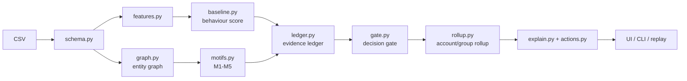
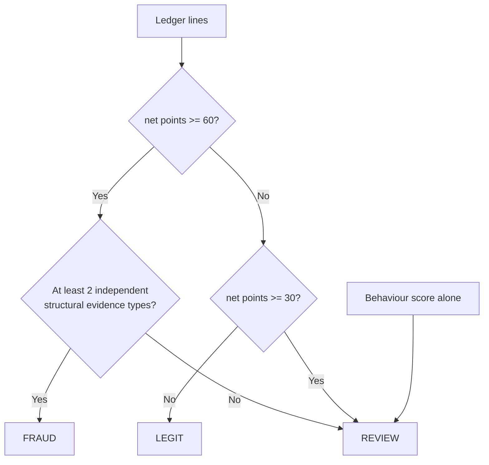
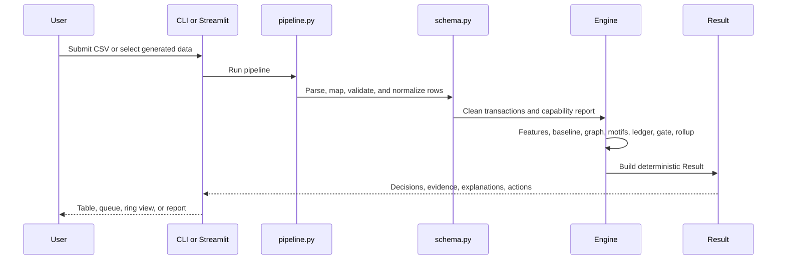

<div align="center">

# TRACE-FX

**Don't just detect the fraud. Show the evidence, and show why we didn't accuse the innocent.**

[](https://www.python.org/)
[](LICENSE)
[](#see-it-in-60-seconds)


</div>

<!-- TODO: verify docs/assets/rings.png exists before publishing this README. -->
<!-- TODO: add a 90-second demo link when docs/assets/demo.mp4 or a YouTube URL exists. -->

## Contents

- [Why this is different](#why-this-is-different)
- [See it in 60 seconds](#see-it-in-60-seconds)
- [What the problem asked, and where to find it](#what-the-problem-asked-and-where-to-find-it)
- [How it works](#how-it-works)
- [The five detectors](#the-five-detectors)
- [Results](#results)
- [Data](#data)
- [Project structure](#project-structure)
- [Reproducibility and quality](#reproducibility-and-quality)
- [Demo script](#demo-script)
- [Limitations and honest notes](#limitations-and-honest-notes)
- [Resources, AI usage and licences](#resources-ai-usage-and-licences)
- [FAQ](#faq)

> [!WARNING]
> The evaluation data is synthetic. Results are not claims about performance on real bank data.

## Why this is different

TRACE-FX separates unusual behaviour from an accusation. An IsolationForest supplies a behavioural anomaly score. Structural detectors then look for explicit transaction relationships. The ledger records positive and exculpatory evidence. The gate requires both enough points and independent structural evidence before assigning `FRAUD`.

| Question | Typical approach | TRACE-FX |
|---|---|---|
| Framing | One model score is often treated as the answer. | ML identifies unusual behaviour; evidence determines the decision. |
| Explanation | Explanation can be separate from the score. | Every decision is backed by ledger lines, evidence types, and transaction IDs. |
| Thresholding | A score threshold can be difficult to audit. | `FRAUD` requires `net_points >= 60` and at least two independent structural evidence types. |
| Uncertainty | Unusual behaviour can be confused with fraud. | Behaviour alone cannot produce `FRAUD`; lower evidence stays `REVIEW` or `LEGIT`. |
| Evaluation | Aggregate metrics can hide ring-level misses. | Evaluation includes precision, recall, precision@k, PR-AUC, ring recall, and legitimate high-value checks. |
| Demo | A dashboard can hide the reasoning path. | The UI exposes the account queue, evidence ledger, group/ring view, and causal replay. |

## See it in 60 seconds

### Windows PowerShell

<details open>
<summary>Setup and launch</summary>

```powershell
python -m pytest -q
python -m tracefx eval --data-dir data --out reports
python -m tracefx prepare --dataset fraud_ecommerce --raw data\Traindata --out data\external
python -m tracefx hybrid --raw data\Traindata --out data\external --rows 30000 --seed 20261007
python -m tracefx score data\external\fraud_ecommerce_canonical.csv --config configs\fraud_ecommerce.yaml --out reports\ext_fraud_ecommerce
python -m tracefx score data\external\hybrid_ecom_canonical.csv --config configs\hybrid_ecom.yaml --out reports\ext_hybrid_ecom
python -m tracefx eval --external data\external --out reports
python -m streamlit run app\app.py


Open <http://localhost:8501>.

<!-- TODO: confirm whether `python -m tracefx demo` exists in src/tracefx/cli.py. The available walkthrough documents `data`, `eval`, and Streamlit launch instead. -->

</details>

### macOS/Linux

<details>
<summary>Setup and launch</summary>

```bash
python3 -m venv .venv
source .venv/bin/activate
python -m pip install --upgrade pip
pip install -e .
pip install -r requirements.txt
python -m tracefx data
python -m tracefx eval --data-dir data --out reports
python -m streamlit run app/app.py
```

Open <http://localhost:8501>.

</details>


### Troubleshooting

<details>
<summary>Common issues</summary>

- **PowerShell execution policy:** if activation is blocked, use the PowerShell execution-policy setting permitted by your machine, or invoke `.venv\Scripts\python.exe` directly.
- **Python version:** `Python >= 3.10` is required by the project setup. <!-- TODO: verify from pyproject.toml. -->
- **Port in use:** launch Streamlit with an alternate port, for example `python -m streamlit run app/app.py --server.port 8502`.
- **Offline use:** the architecture specifies vendored `vis-network` assets, so the replay does not depend on a remote CDN. <!-- TODO: verify the asset path and generated HTML on a clean checkout. -->

</details>

## What the problem asked, and where to find it

<!-- TODO: SCOPE.md supplied in the workspace does not contain per-row DONE/PARTIAL/NOT DONE statuses. Add only rows whose status is explicitly DONE after running the compliance checks. -->

| Requirement | UI tab | How to verify |
|---|---|---|
| <!-- TODO: copy a row with Status = DONE from docs/PS04_COMPLIANCE_MATRIX.md --> | <!-- TODO --> | <!-- TODO --> |

## How it works

### Architecture flow



### Decision gate



Behaviour alone never produces `FRAUD`.

### One request from CSV to Result



### Evidence ledger example

<!-- TODO: copy a short ledger excerpt verbatim from a real file under docs/sample/ after confirming that the file exists. Do not invent an example. -->

## The five detectors

| Motif | What it looks for | Parameter names from `config.yaml` | Hard negative it must not flag |
|---|---|---|---|
| M1 Shared device | Multiple accounts use the same device with no prior legitimate history. | <!-- TODO: read exact M1 parameter names from config.yaml. --> | Family device sharing |
| M2 Common sink | At least four distinct payers send money to one payee within 24 hours. | <!-- TODO: read exact M2 parameter names from config.yaml. --> | Landlord or salary-style repeat payee |
| M3 Pass-through | At least 80% of received money is forwarded within 30 minutes. | <!-- TODO: read exact M3 parameter names from config.yaml. --> | Legitimate rapid transfer pattern |
| M4 Sequence cohort | Accounts share rare ordered 3-gram transaction sequences and converge on a sink or pass-through. | <!-- TODO: read exact M4 parameter names from config.yaml. --> | Flash-sale or common campaign activity |
| M5 Burst | A transaction burst breaks the account's own baseline and has clustered start times. | <!-- TODO: read exact M5 parameter names from config.yaml. --> | Salary burst or traveller activity |

The graph applies a hub cap. Shared infrastructure such as a Wi-Fi IP or device connected to more than eight accounts is dropped from ring evidence. Sequence cohorts count only when they converge on a sink or pass-through pattern.

## Results

<!-- METRICS:START -->

The following values are from the supplied evaluation table. Every row uses synthetic data.

| Seed | Transactions | Accounts | FRAUD accounts | REVIEW accounts | Groups | Ring recall | Precision (FRAUD) | Recall (FRAUD) | Precision@10 | Precision@50 | PR-AUC | Latency per transaction |
|---|---:|---:|---:|---:|---:|---|---:|---:|---:|---:|---:|---:|
| `seedA` | 45332 | 2005 | 3 | 203 | 78 | 5/5 full; 0 partial; 0 missed | 0.0 | 0.0 | 0.4 | 0.34 | 0.3698 | 0.641 ms |
| `seedB` | 45023 | 2005 | 10 | 240 | 51 | 5/5 full; 0 partial; 0 missed | 0.6 | 0.2727 | 0.3 | 0.38 | 0.4239 | 0.64 ms |
| `seedC` | 45220 | 2005 | 11 | 227 | 57 | 6/6 full; 0 partial; 0 missed | 0.3636 | 0.1905 | 0.0 | 0.38 | 0.3357 | 0.622 ms |
| `demo_small` | 5186 | 602 | 5 | 159 | 20 | 2/2 full; 0 partial; 0 missed | 0.6 | 0.3 | 0.5 | 0.16 | 0.395 | 1.021 ms |

### Comparison with the IsolationForest baseline

<!-- TODO: reports/eval_results.csv supplied in the workspace does not include baseline comparison columns. -->

| Seed | FP on legitimate high-value set: FRAUD only | FP on legitimate high-value set: FRAUD or REVIEW | TRACE-FX precision | IsolationForest baseline precision | TRACE-FX PR-AUC | IsolationForest baseline PR-AUC |
|---|---:|---:|---:|---:|---:|---:|
| `seedA` | 0 | 3 | 0.0 | <!-- TODO --> | 0.3698 | <!-- TODO --> |
| `seedB` | 0 | 2 | 0.6 | <!-- TODO --> | 0.4239 | <!-- TODO --> |
| `seedC` | 0 | 2 | 0.3636 | <!-- TODO --> | 0.3357 | <!-- TODO --> |
| `demo_small` | 0 | 4 | 0.6 | <!-- TODO --> | 0.395 | <!-- TODO --> |

### Known misses

<!-- TODO: copy the named misses from docs/EVAL_SUMMARY.md. That file was not available in the supplied repository tree. -->

Synthetic data generated by `simulate.py`; numbers are optimistic relative to real data.

<!-- METRICS:END -->

## Data

Input and output contracts are specified in [`docs/DATA_SPEC.md`](docs/DATA_SPEC.md). <!-- TODO: verify the file exists in the repository. -->

| File | Use |
|---|---|
| `data/seedA.csv` | Synthetic evaluation seed A |
| `data/seedB.csv` | Synthetic evaluation seed B |
| `data/seedC.csv` | Synthetic evaluation seed C |
| `data/demo_small.csv` | Small interactive demonstration dataset |

Regenerate the synthetic files with:

```powershell
python -m tracefx data
```

The documented scenarios include shared-device activity, common sinks, pass-through flows, sequence cohorts, bursts, and legitimate hard negatives such as family device sharing, hostel Wi-Fi, flash sales, landlord payments, salary bursts, and traveller activity. <!-- TODO: verify exact hard-negative and ring-type names against simulate.py and EVAL_SUMMARY.md. -->

## Project structure

```text
.
├── app/                 # Streamlit dashboard and local visualisation assets
├── data/                # Generated CSV data and ground truth
├── docs/                # Architecture, contracts, data specification, demo, and compliance
├── reports/             # Evaluation output and case-file artifacts
├── src/tracefx/         # Deterministic fraud-intelligence pipeline
├── tests/               # Pytest checks
├── config.yaml          # Frozen thresholds, weights, windows, and caps
├── requirements.txt     # Runtime dependencies
├── requirements.lock.txt# Locked dependency set
└── pyproject.toml       # Package configuration
```

The architectural source of truth is [`docs/ARCHITECTURE_LOCK.md`](docs/ARCHITECTURE_LOCK.md). <!-- TODO: verify the file exists in the repository. -->

## Reproducibility and quality

- Evaluation seeds are `42` for `seedA`, `7` for `seedB`, and `2026` for `seedC`; `demo_small` uses seed `42`.
- `requirements.lock.txt` is listed as the locked dependency set. <!-- TODO: verify the file exists and record its reproducibility hash. -->
- The pipeline is designed to be deterministic and fail-soft. Failed stages are recorded in `degraded`.
- <!-- TODO: record the determinism hash from a clean run. -->
- <!-- TODO: record the test count from the last `pytest` run. -->
- <!-- TODO: add the GitHub Actions workflow link after confirming `.github/workflows/ci.yml` exists. -->
- `tools/preflight.py` is required by the submission checklist. <!-- TODO: verify the file exists and document its command. -->

Run the test suite with:

```bash
pytest tests/
```

## Demo script

<details>
<summary>Two-minute judge flow</summary>

<!-- TODO: replace this outline with the exact sequence from docs/DEMO.md after the file is available. -->

1. Generate `demo_small` with `python -m tracefx data`.
2. Launch the dashboard with `python -m streamlit run app/app.py`.
3. Show the ranked account queue and transaction risk table.
4. Open a decision and show positive evidence and exculpatory ledger lines.
5. Open the ring view and show the evidence-linked group.
6. Run evaluation and open `reports/eval_results.csv`.

</details>

## Limitations and honest notes

- The evaluation uses synthetic data.
- Weights, thresholds, and caps are hand-set and transparent.
- Rings with no shared entities can fall to `REVIEW` or be missed. <!-- TODO: name the specific misses from docs/EVAL_SUMMARY.md. -->
- TRACE-FX is not a streaming engine. It performs causal batch replay with per-transaction latency.
- No real bank data is included.
- The system does not use a GNN, graph database, or LLM explanations, by design.

## Resources, AI usage and licences

The following disclosure is copied from `DISCLOSURE.md`:

| Resource | Type | Use | Ours |
|---|---|---|---|
| scikit-learn IsolationForest | library | behaviour score | features, gate |
| NetworkX | library | graph structures | motifs, ledger |
| vis-network (vendored JS; check its licence text when vendoring) | library | ring diagram, replay | HTML generator |
| Streamlit, Jinja2, PyYAML | libraries | UI, case file, config | app, templates |
| Synthetic generator | own code | all demo/eval data | all |
| AI coding assistants | tools | code drafting | review, tests, design decisions |
| Pre-hackathon prep | process | env, simulator, eval harness written before the event | declared here |
| IEEE-CIS (only if used) | dataset | sanity run | adapter |

This repository is licensed under the MIT License. The `vis-network` licence text must be checked in the vendored asset directory before distribution. <!-- TODO: verify the vendored licence file. -->

## FAQ

<details>
<summary>Why no GNN?</summary>

The documented design excludes GNNs. The rubric emphasizes evidence, precision, ring detection, and explanations. TRACE-FX uses an IsolationForest for behavioural unusualness and transparent structural detectors for evidence.

</details>

<details>
<summary>Is it real-time?</summary>

No. It is causal batch replay with per-transaction latency. It is not a real-time streaming engine.

</details>

<details>
<summary>Is the data real?</summary>

No. The primary demo and evaluation data are generated by the project's synthetic simulator.

</details>

<details>
<summary>Are weights learned?</summary>

No. The structural detector rules, ledger weights, thresholds, and caps are hand-set and transparent. The behavioural score uses an unsupervised IsolationForest over engineered features.

</details>

<details>
<summary>What if my CSV has different columns?</summary>

The schema layer maps and normalizes input columns, handles missing data, and parses timestamps. Use [`docs/DATA_SPEC.md`](docs/DATA_SPEC.md) for the supported contract. <!-- TODO: verify the document path. -->

</details>

<details>
<summary>What happens when a stage fails?</summary>

The pipeline uses fail-soft stage wrappers. It records the failed stage in `degraded` and uses a fallback result. For example, motif failure caps the outcome at behaviour-only labels, and visualisation failure falls back to a static table.

</details>

---

**Team:** <!-- TODO: team names -->

[Back to top](#trace-fx)

<!--
TODO: Before publishing, apply these repository settings:
- Description: TRACE-FX — deterministic, evidence-first financial fraud intelligence for HNX26PSI04.
- Topics: fraud-detection, graph-analytics, anomaly-detection, explainable-ai, fintech, streamlit, networkx, scikit-learn, hackathon
- Website/demo link: TODO: add the final demo URL.
- Social preview image: generate a 1280x640 image from docs/assets/rings.png.
-->
