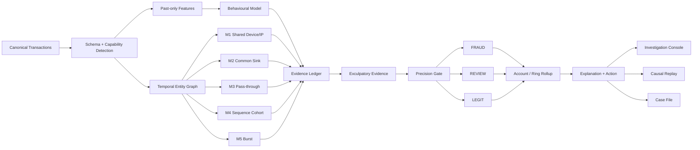
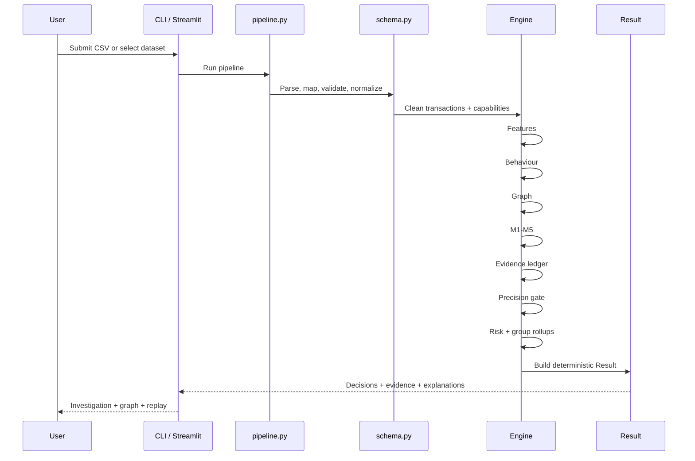
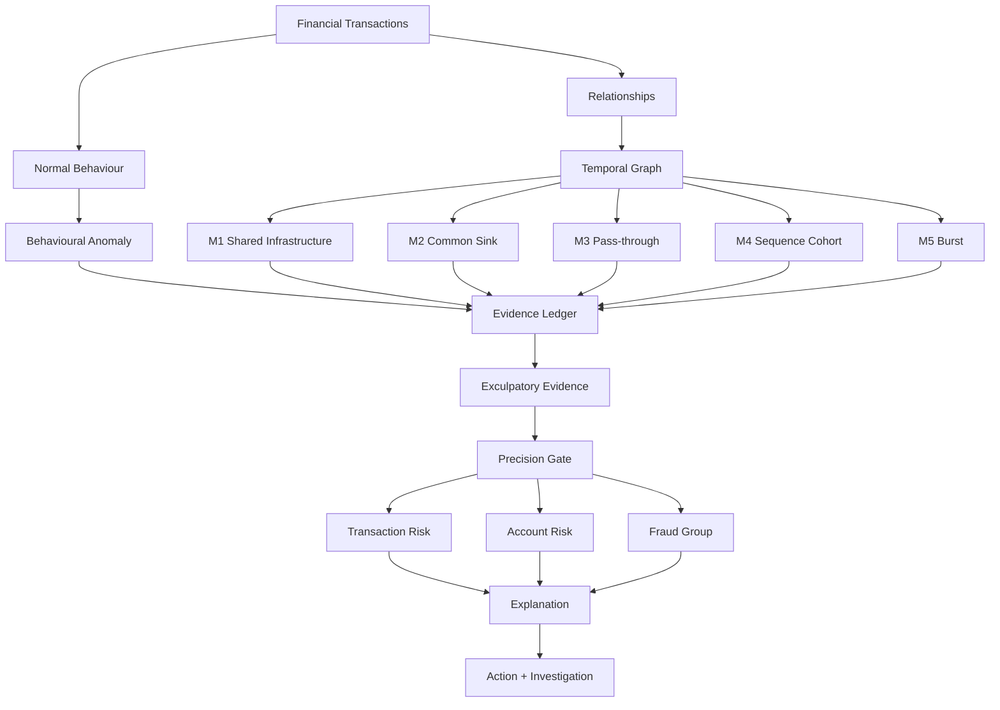

<div align="center">

# TRACE-FX

### Temporal Risk & Coordinated Evidence Engine for Financial Fraud

**Don't just detect the fraud. Show the evidence — and show why the system did not accuse the innocent.**

[](https://www.python.org/)
[](#engineering-quality)
[](#ps04-compliance)
[](LICENSE)
[](#quickstart)

**Behaviour → Relationships → Motifs → Evidence → Gate → Decision → Investigation**

</div>

---

## Contents

- [TRACE-FX at a Glance](#trace-fx-at-a-glance)
- [The Problem: Fraud Is a Pattern, Not a Transaction](#the-problem-fraud-is-a-pattern-not-a-transaction)
- [The TRACE-FX Answer](#the-trace-fx-answer)
- [Why This Architecture Is Different](#why-this-architecture-is-different)
- [Unconventional Advantages](#unconventional-advantages)
- [System Architecture](#system-architecture)
- [Behavioural Intelligence](#behavioural-intelligence)
- [Temporal Entity Graph](#temporal-entity-graph)
- [Structural Fraud Intelligence](#structural-fraud-intelligence)
- [Evidence Model](#evidence-model)
- [Precision Gate](#precision-gate)
- [Risk and Fraud-Group Intelligence](#risk-and-fraud-group-intelligence)
- [Causal Alerting and Temporal Replay](#causal-alerting-and-temporal-replay)
- [Investigation Console](#investigation-console)
- [Real-Time-Oriented Design](#real-time-oriented-design)
- [External and Hybrid Data Intelligence](#external-and-hybrid-data-intelligence)
- [Evaluation](#evaluation)
- [Engineering Quality](#engineering-quality)
- [Data and Capability Intelligence](#data-and-capability-intelligence)
- [Reproducibility](#reproducibility)
- [PS04 Compliance](#ps04-compliance)
- [Judge Demonstration](#judge-demonstration)
- [Project Structure](#project-structure)
- [Technology Stack](#technology-stack)
- [Engineering Decisions](#engineering-decisions)
- [Security and Data Separation](#security-and-data-separation)
- [AI and External Resource Disclosure](#ai-and-external-resource-disclosure)
- [GitHub Repository](#github-repository)
- [Project Philosophy](#project-philosophy)
- [Final System Summary](#final-system-summary)
- [License](#license)

---

# TRACE-FX at a Glance

TRACE-FX is a **temporal fraud-intelligence and investigation engine** designed for coordinated financial fraud.

It is built around a simple observation:

> **Fraud does not always look suspicious one transaction at a time. It becomes visible when behaviour, relationships, timing and repeated structure are examined together.**

Instead of treating fraud detection as:

```text
transaction → ML model → fraud probability
```

TRACE-FX treats it as:

```text
transaction
    ↓
understand normal behaviour
    ↓
discover relationships
    ↓
detect coordinated structures
    ↓
construct evidence
    ↓
add counter-evidence
    ↓
apply an auditable precision gate
    ↓
FRAUD / REVIEW / LEGIT
    ↓
explain why
    ↓
show the network
    ↓
show when the evidence became sufficient
```

The result is not merely a score.

It is an **auditable fraud case**.

Every important decision can be traced back to:

- the transaction;
- behavioural signals;
- structural relationships;
- fraud motifs;
- supporting transaction IDs;
- the timestamp at which the evidence became sufficient;
- positive evidence;
- exculpatory evidence;
- the final gate calculation;
- the resulting action.

---

# The Problem: Fraud Is a Pattern, Not a Transaction

## HNX26PSI04 — Real-Time Financial Fraud Intelligence

**FinTech · Graph ML · Anomaly Detection · AI**

Fraud does not always hide in one suspicious transaction.

It can hide across:

- accounts;
- devices;
- stores;
- merchants;
- IP addresses;
- payment channels;
- transaction timing;
- repeated item or merchant sequences;
- money-flow relationships.

A single transaction may look completely normal.

The network around it may not.

The challenge is therefore not simply:

> **"Can we identify a suspicious transaction?"**

It is:

> **"Can we discover when multiple apparently normal transactions form a coordinated fraud pattern?"**

---

## The Core Challenge

Consider ten accounts.

They may have:

- different identities;
- different locations;
- different devices;
- different transaction amounts.

Individually, nothing may look sufficiently suspicious.

But suppose they:

```text
buy the same unusual items
        ↓
in the same sequence
        ↓
within a related time window
        ↓
then move money
        ↓
toward the same destination
```

The individual transactions may look ordinary.

The **pattern** says fraud.

That is the central problem TRACE-FX is designed to solve.

---

## What the System Must Produce

The PS04 problem asks for more than a binary prediction.

A useful fraud-intelligence system must expose:

| Required intelligence | TRACE-FX output |
|---|---|
| Risk for each transaction | Transaction-level evidence risk |
| Risk for each account | Noisy-OR account risk |
| Suspicious accounts acting together | Evidence-linked fraud groups |
| Pattern discovered | M1–M5 structural motifs |
| Connections | Typed temporal graph |
| Reason for risk | Evidence ledger |
| Legitimate context | Exculpatory evidence |
| Action | FRAUD / REVIEW / LEGIT policy |
| Timing | Causal `alert_ts` |
| Investigator view | Investigation console + replay |

---

## The PS04 Success Criteria

The system must answer:

- Can it find fraud rings?
- Can it catch fraud without excessive false alarms?
- Can it recover real fraud?
- Can it rank transactions and accounts by risk?
- Can it avoid flagging legitimate high-value transactions?
- Can it identify unusual behaviour relative to normal behaviour?
- Can it explain why something looks suspicious?

TRACE-FX treats each of these as a distinct engineering problem rather than collapsing everything into one model score.

---

# The TRACE-FX Answer

TRACE-FX separates the problem into two complementary intelligence layers.

## Behavioural Intelligence

> **Is this behaviour unusual for this account?**

Handled by:

- past-only behavioural features;
- velocity;
- amount deviation;
- novelty;
- peer deviation;
- time-of-day deviation;
- drift;
- Isolation Forest anomaly scoring.

## Structural Intelligence

> **Is there evidence that this behaviour is coordinated?**

Handled by:

- temporal entity graph;
- shared-device/IP relationships;
- common sinks;
- pass-through flows;
- sequence cohorts;
- bursts;
- evidence-linked groups.

The two layers meet inside the evidence ledger.

This gives the architecture a clear separation of responsibilities:

```text
Behaviour tells us:
"Something is unusual."

Structure tells us:
"Something may be coordinated."

Evidence tells us:
"Here is what supports that conclusion."

Counter-evidence tells us:
"Here is what argues against it."

The gate tells us:
"Is the case strong enough to accuse?"

Replay tells us:
"When did we know?"
```

---

# Why This Architecture Is Different

| Fraud-system question | TRACE-FX approach |
|---|---|
| What does the account normally do? | Past-only behavioural features and anomaly scoring |
| What is connected to this transaction? | Typed temporal entity graph |
| Is the behaviour coordinated? | Five explicit structural fraud motifs |
| Why was this transaction suspicious? | Evidence objects linked to transactions and timestamps |
| Why wasn't it immediately called fraud? | `REVIEW` tier and counter-evidence |
| Can the decision be audited? | Point-based evidence ledger |
| Can infrastructure create false rings? | Hub-cap protection |
| Can one anomaly score accuse someone? | No — behaviour alone cannot produce `FRAUD` |
| Can one structural coincidence create a fraud accusation? | No — strict gate requires independent structural evidence |
| Can legitimate history reduce suspicion? | Yes — exculpatory evidence subtracts points |
| When did the system actually know? | Causal `alert_ts` |
| How are fraud rings formed? | Evidence-linked components rather than raw graph connectivity |
| Can the investigator understand the result? | Ledger + explanation + graph + temporal replay |
| Can the engine operate with incomplete data? | Capability detection and graceful degradation |
| Can the system be tested independently of labels? | Yes — detection and evaluation are separated |

The architecture makes the **reasoning path visible**.

---

# Unconventional Advantages

## The Explanation Is Part of the Computation

Many systems calculate a prediction first and attempt to explain it afterwards.

TRACE-FX does the opposite.

The evidence ledger is part of the decision path:

```text
Behaviour
    +
M1
    +
M2
    +
M4
    -
known legitimate history
    =
Net Evidence
    ↓
Precision Gate
    ↓
Decision
```

The explanation is therefore not decorative UI.

It is a representation of the computation that produced the decision.

---

## It Has a Built-In "Why Not Fraud?" Mechanism

False positives are not treated as an afterthought.

TRACE-FX explicitly models evidence that should reduce suspicion:

- established account tenure;
- previously observed payees;
- previously observed devices;
- normal amount ranges;
- peer-normal behaviour.

This creates an unusual property for a fraud system:

> **The system can construct a case for suspicion and a case against suspicion.**

That is particularly useful for high-value legitimate transactions.

---

## Fraud Requires Independent Structural Agreement

A single signal is intentionally insufficient.

The gate requires:

```text
net evidence >= 60
AND
at least 2 independent structural evidence types
```

Therefore:

```text
High anomaly score
        ≠
Fraud
```

and:

```text
One shared device
        ≠
Fraud
```

The architecture asks for **converging evidence**.

---

## Shared Infrastructure Is Treated Differently From Coordinated Infrastructure

Fraud graphs have a dangerous property:

> **The most connected node is not necessarily the most suspicious node.**

A university Wi-Fi network, hostel, office, household, VPN exit node, or shared device can connect many legitimate users.

TRACE-FX therefore uses **hub caps**.

Highly shared infrastructure can be excluded from ring evidence rather than becoming a universal bridge between unrelated accounts.

---

## Fraud Rings Are Built From Evidence Links

Raw graph connectivity is too permissive.

If:

```text
A ── shared Wi-Fi ── B ── shared Wi-Fi ── C
```

then a naive connected-component algorithm may conclude:

```text
A, B, C = one suspicious group
```

TRACE-FX instead constructs fraud groups from **verified evidence relationships**.

The graph discovers structure.

The evidence layer decides which relationships deserve investigative meaning.

---

## Temporal Causality Is a First-Class Concept

A fraud system should answer:

> **"When could you have known?"**

not merely:

> **"After seeing the entire dataset, was this transaction suspicious?"**

TRACE-FX records `Evidence.satisfied_at` and derives the causal `alert_ts`.

Conceptually:

```text
t1 ─── unusual behaviour
t2 ─── shared infrastructure discovered
t3 ─── common sink established
t4 ─── second structural condition satisfied
                 │
                 ▼
             ALERT_TS
```

Evidence occurring after the decision cannot retroactively create the earlier alert.

This makes the system suitable for **temporal replay and real-time-oriented decision architectures**.

---

# System Architecture

## Architecture Flow



---

## End-to-End Pipeline

```text
CSV
 │
 ▼
schema.py
 │
 ├── validation
 ├── normalization
 ├── capability detection
 └── data quality
 │
 ▼
features.py
 │
 ├── velocity
 ├── amount deviation
 ├── novelty
 ├── peer deviation
 ├── time-of-day deviation
 └── behavioural history
 │
 ▼
baseline.py
 │
 └── IsolationForest anomaly score
 │
 ▼
graph.py
 │
 ├── ACCOUNT
 ├── DEVICE
 ├── IP
 ├── MERCHANT
 ├── TRANSACTION
 └── other available entities
 │
 ▼
motifs.py
 │
 ├── M1 Shared Device/IP
 ├── M2 Common Sink
 ├── M3 Pass-through
 ├── M4 Sequence Cohort
 └── M5 Burst
 │
 ▼
Evidence[]
 │
 ▼
ledger.py
 │
 ├── positive evidence
 └── exculpatory evidence
 │
 ▼
gate.py
 │
 ├── FRAUD
 ├── REVIEW
 └── LEGIT
 │
 ▼
rollup.py
 │
 ├── account risk
 └── evidence-linked groups
 │
 ▼
explain.py + actions.py
 │
 ▼
Result
 │
 ├── Streamlit investigation console
 ├── CLI
 ├── temporal replay
 └── case files
```

---

## One Request From CSV to Result



---

# Behavioural Intelligence

## The Behavioural Question

TRACE-FX first asks:

> **What is unusual relative to the account's own history and peer context?**

Behaviour is used to understand what is unusual for an account.

TRACE-FX uses temporally causal features such as:

```text
velocity_1h
velocity_24h
amount_vs_p95
amount_pct_rank
new_device_flag
new_payee_flag
time-of-day deviation
peer deviation
novelty
drift
```

Rolling features are constructed using information available before the transaction being evaluated.

---

## Isolation Forest

The behavioural model is an Isolation Forest.

Configured baseline:

```text
n_estimators = 100
contamination = 0.02
```

The resulting score is normalized to:

```text
0.0 → normal
1.0 → highly unusual
```

The behavioural model answers:

> **"How unusual is this?"**

It does not answer:

> **"Is this definitely fraud?"**

Therefore:

> **The behavioural score is evidence, not a verdict.**

---

# Temporal Entity Graph

TRACE-FX converts transaction relationships into a typed temporal graph.

## Entity Types

Possible entities include:

```text
ACCOUNT
DEVICE
IP
MERCHANT
TRANSACTION
LOCATION
```

Example:

```text
ACCOUNT_A
    │
    ├── DEVICE_17
    │
    ├── IP_204
    │
    └── TRANSACTION_881
              │
              ▼
          ACCOUNT_SINK
```

Edges retain transaction context such as:

- timestamp;
- transaction ID;
- amount;
- channel;
- relationship type.

The graph therefore answers a different question from the behavioural model:

> **"Who or what is this transaction connected to, and how?"**

---

# Structural Fraud Intelligence

## The Five Structural Detectors

TRACE-FX uses five explicit structural fraud motifs.

---

## M1 — Shared Device / IP

Detects multiple accounts sharing infrastructure in a pattern that has investigative significance.

The detector is designed to distinguish coordinated reuse from benign shared infrastructure.

A suspicious pattern may look like:

```text
ACCOUNT_1 ─┐
ACCOUNT_2 ─┤
ACCOUNT_3 ─┼── DEVICE_X
ACCOUNT_4 ─┤
ACCOUNT_5 ─┘
```

The shared relationship becomes stronger when combined with other independent evidence.

---

## M2 — Common Sink

Detects multiple distinct payers converging on a common recipient within the configured temporal window.

Baseline configuration:

```text
4+ distinct payers
→ one payee
→ within 24 hours
```

Conceptually:

```text
A ─┐
B ─┤
C ─┼────> SINK
D ─┤
E ─┘
```

This captures one of the clearest structural signatures of collection or aggregation behaviour.

---

## M3 — Pass-through

Detects rapid onward movement of received funds.

Baseline rule:

```text
80%+ of received value
→ transferred onward
→ within 30 minutes
```

Conceptually:

```text
SOURCE
   │
   ▼
  MULE
   │
   ▼
DESTINATION
```

This is useful for identifying intermediary accounts whose role is better understood from money movement than from individual transaction anomalies.

---

## M4 — Sequence Cohort

M4 looks for coordinated sequences shared by multiple accounts.

The important design choice is that a sequence does not become suspicious merely because several users performed the same actions.

The cohort must exhibit stronger structural convergence, such as:

```text
rare sequence
      +
multiple accounts
      +
convergence on sink / pass-through structure
```

This makes M4 useful for coordinated campaigns and scripted transaction behaviour.

---

## M5 — Burst

Detects unusually concentrated activity relative to an account's own historical behaviour.

The baseline includes burst and temporal clustering behaviour rather than relying only on absolute transaction count.

This is useful for:

- account takeover patterns;
- automated activity;
- coordinated campaigns;
- sudden operational changes.

---

# Hub-Cap Protection

One of the strongest false-positive protections is the hub-cap mechanism.

Shared infrastructure can create enormous artificial graph connectivity.

TRACE-FX therefore applies degree caps to infrastructure such as devices and IP addresses.

A configured cap such as:

```text
deg_cap_device = 8
```

prevents highly shared infrastructure from automatically becoming a fraud-ring connector.

For example:

```text
                 PUBLIC WIFI
        /     /      |      \     \
       A     B       C       D      E
```

should not automatically become:

```text
A + B + C + D + E = fraud ring
```

The system instead asks whether the relationship participates in stronger evidence.

---

# Evidence Model

## Evidence Objects

Each structural signal becomes an explicit evidence object.

Conceptually:

```python
Evidence(
    type="M2_COMMON_SINK",
    accounts=[...],
    tx_ids=[...],
    first_ts=...,
    last_ts=...,
    satisfied_at=...,
    strength=...,
    detail=...
)
```

Important fields include:

### `type`

What kind of evidence was detected?

### `accounts`

Who participates?

### `tx_ids`

Which transactions prove it?

### `first_ts` / `last_ts`

What temporal interval contains the evidence?

### `satisfied_at`

When did the condition become true?

### `strength`

How strong is the evidence?

### `detail`

What exactly happened?

This makes the evidence inspectable instead of reducing it to an opaque probability.

---

# Evidence Ledger

TRACE-FX converts evidence into a ledger.

The basic model is:

```text
Net Evidence
=
Positive Evidence
-
Exculpatory Evidence
```

## Positive Evidence

Baseline positive weights include:

| Evidence | Points |
|---|---:|
| Behavioural anomaly | +20 |
| M1 Shared Device/IP | +20 |
| M2 Common Sink | +30 |
| M3 Pass-through | +25 |
| M4 Sequence Cohort | +25 |
| M5 Burst | +10 |
| Sleeper / coordinated inactivity pattern | +10 |

## Exculpatory Evidence

| Counter-evidence | Points |
|---|---:|
| Account tenure > 1 year | -15 |
| Payee seen repeatedly before | -20 |
| Device used repeatedly before | -10 |
| Amount within account historical p95 | -10 |
| Within peer-normal range | -5 |

The exact configuration remains centralized and auditable.

---

# Precision Gate

The final decision is intentionally more conservative than the anomaly detector.

## FRAUD

Requires:

```text
net_points >= 60
AND
2+ independent structural evidence types
```

## REVIEW

Triggered by meaningful suspicion such as:

```text
net_points >= 30
OR
one strong structural evidence type
```

## LEGIT

Everything below the review boundary.

And critically:

```text
Behaviour alone
        ↓
cannot
        ↓
FRAUD
```

This is one of TRACE-FX's strongest architectural safeguards.

---

# Risk and Fraud-Group Intelligence

## Transaction Risk

Transaction risk is derived from the evidence ledger:

```text
p_i = clip(net_points / 100, 0, 1)
```

---

## Account Risk

Account-level risk is rolled up using Noisy-OR:

```text
R_account = 1 - Π(1 - p_i)
```

This allows multiple suspicious transactions to contribute to account-level exposure without simply summing probabilities.

---

## Fraud Groups

Fraud groups are not constructed from arbitrary graph components.

They are built from **evidence links**.

Raw connectivity:

```text
A ─ device ─ B ─ IP ─ C
```

does not automatically mean:

```text
A, B, C = fraud ring
```

Evidence connectivity:

```text
A ─ M1 ─ B
│
├── M2 ──> SINK
│
└── M4 ──> COHORT
```

creates a much stronger investigative group.

Typical group shapes include:

- star / collection network;
- mule chain;
- coordinated cohort;
- shared infrastructure cluster;
- sink-and-spoke network.

---

# Causal Alerting and Temporal Replay

TRACE-FX records when sufficient evidence actually becomes available.

Conceptually:

```text
alert_ts =
max(
    transaction timestamp,
    satisfied_at of evidence required by the gate
)
```

This produces a causal timeline:

```text
09:01  unusual transaction
09:07  device relationship appears
09:14  common sink condition becomes true
09:18  second structural condition becomes true
       │
       └── alert_ts = 09:18
```

This gives investigators an answer to:

> **"At what point did the system have enough evidence to act?"**

Temporal replay reconstructs this progression rather than displaying only the final state.

---

# Investigation Console

The Streamlit application is designed as a fraud investigation console rather than a generic analytics dashboard.

## Command Center

Shows:

- selected dataset;
- pipeline status;
- transaction counts;
- account counts;
- fraud/review/legit distribution;
- suspicious groups;
- dataset capabilities.

## Investigation

For a selected transaction or account:

```text
DECISION
RISK
ALERT TIME
ACTION

WHY
 ├── behavioural evidence
 ├── structural evidence
 ├── supporting transactions
 └── counter-evidence

EVIDENCE LEDGER
 ├── +20 behaviour
 ├── +20 M1
 ├── +30 M2
 ├── -20 known payee
 └── NET

PRECISION GATE
 ├── threshold
 ├── structural evidence count
 └── final decision
```

## Fraud Networks

Shows the evidence-linked graph.

## Temporal Replay

Reconstructs the investigation through transaction timestamps and evidence satisfaction times.

## Why Not Fraud?

Makes legitimate high-value cases inspectable.

Example:

```text
HIGH VALUE TRANSACTION

+ established account
+ known payee
+ known device
+ normal peer behaviour
+ no coordinated structural evidence

                 ↓

              LEGIT
```

This is an important part of the system, not decorative UI.

---

# Real-Time-Oriented Design

TRACE-FX is built around **transaction-time reasoning**.

The engine's state is derived from:

- historical account behaviour;
- relationships available at the transaction;
- temporal evidence;
- evidence satisfaction timestamps;
- deterministic decision gates.

That architecture is intentionally compatible with real-time-oriented fraud workflows.

The current implementation provides:

- causal chronological replay;
- deterministic batch scoring;
- per-transaction decision timestamps;
- transaction-level risk;
- account-level rollups;
- evidence-linked network analysis.

The analytical core therefore does not depend on a fundamentally static decision model.

A future deployment can place the same decision architecture behind an event ingestion layer:

```text
Transaction Event
      ↓
State / History
      ↓
Feature Update
      ↓
Graph Update
      ↓
Motif Evaluation
      ↓
Evidence Ledger
      ↓
Precision Gate
      ↓
Action
```

The current project demonstrates and validates the **decision architecture and causal computation** locally.

---

# Why the System Does Not Need a Giant Black-Box Model

TRACE-FX uses machine learning where it provides the most value:

```text
"What is unusual?"
```

and explicit structural reasoning where it is most valuable:

```text
"Why is this coordinated?"
```

This creates a useful division of responsibility:

| Component | Responsibility |
|---|---|
| Isolation Forest | Behavioural abnormality |
| Temporal graph | Relationships |
| M1–M5 | Structural fraud patterns |
| Evidence ledger | Auditability |
| Exculpatory evidence | False-positive control |
| Precision gate | Final accusation |
| Rollup | Account/group risk |
| Explanation | Human investigation |
| Replay | Temporal reasoning |

The model is therefore not the entire system.

It is one component inside a larger decision architecture.

---

# Why Not GNN / Why Not LLM?

The project deliberately prioritizes **inspectability, deterministic reasoning, and judgeability**.

A larger model would not automatically improve the core question:

> **"Can an investigator see exactly why this account was accused?"**

TRACE-FX instead makes network structure explicit.

A judge can inspect:

```text
transaction
→ feature
→ motif
→ evidence
→ ledger
→ gate
→ decision
```

without needing to trust a hidden representation.

Similarly, LLM-generated explanations are not required because the evidence ledger already contains the structured facts necessary to explain the decision.

The explanation layer translates computed evidence into human-readable language.

---

# Fail-Soft Architecture

A fraud pipeline should degrade safely rather than silently collapse.

TRACE-FX wraps major processing stages so that failures are represented in the result.

Examples:

```text
graph failure
    ↓
degraded result

motif failure
    ↓
structural evidence unavailable
    ↓
behaviour-only ceiling

visualization failure
    ↓
static investigation output
```

The system exposes degraded stages instead of pretending everything succeeded.

This is particularly valuable for datasets with incomplete schemas.

---

# Data and Capability Intelligence

TRACE-FX does not assume every dataset contains every fraud-relevant field.

## Required Fields

```text
tx_id
ts
payer_id
payee_id
amount
```

## Optional Fields

```text
tx_type
device_id
ip
merchant_id
item_id
channel
city
account_open_date
```

The schema layer detects which capabilities are actually available.

For example:

```text
Dataset capabilities

ACCOUNT          ✓
TRANSACTION      ✓
DEVICE           ✓
IP               ✓
MERCHANT         ✓
ITEM             ✗
LOCATION         ✓
```

The engine can then explain:

```text
M1 Shared Device      ENABLED
M2 Common Sink        ENABLED
M3 Pass-through       ENABLED
M4 Sequence Cohort    PARTIAL
M5 Burst              ENABLED
```

The system does not pretend a dataset contains evidence that it does not contain.

---

# External and Hybrid Data Intelligence

## External Fraud E-commerce Data

TRACE-FX includes an external e-commerce data path.

The external adapter:

- maps source fields to the canonical TRACE-FX schema;
- normalizes timestamps;
- resolves IP information using time-aware joins;
- generates capability metadata;
- keeps truth separate from the detection input;
- scores chronological samples through the same core engine.

A documented external run used:

```text
Converted rows: 151,112
Chronological scored sample: 40,000
Pipeline runtime: 355.99 s
Evidence generated: 444
```

The structural evidence observed in that un-injected sample was:

```text
M1 Shared Device: 443
M2 Common Sink:     1
M3 Pass-through:    0
M4 Sequence Cohort: 0
M5 Burst:           dataset-dependent
```

The engineering result is not that every motif appears in every dataset.

It is that the **same engine measures what the dataset actually supports**.

---

## Hybrid Evaluation

TRACE-FX also supports hybrid evaluation:

```text
real-world background
        +
controlled structural injection
        ↓
hybrid fraud environment
```

The purpose is to test whether structural detectors can recover known injected coordination inside a noisier background.

The hybrid design supports scenarios such as:

- shared-device coordination;
- pass-through chains;
- sink convergence;
- sequence cohorts;
- burst activity;
- legitimate shared infrastructure;
- legitimate high-value activity.

Truth is maintained separately from the canonical transaction CSV.

The detection engine therefore remains label-independent.

---

# Evaluation

The following baseline results are from the project's evaluation runs.

| Dataset | Transactions | Accounts | FRAUD accounts | REVIEW accounts | Groups | Ring recall | Precision | Recall | P@10 | P@50 | PR-AUC |
|---|---:|---:|---:|---:|---:|---|---:|---:|---:|---:|---:|
| `seedA` | 45,332 | 2,005 | 3 | 203 | 78 | 5/5 | 0.0000 | 0.0000 | 0.40 | 0.34 | 0.3698 |
| `seedB` | 45,023 | 2,005 | 10 | 240 | 51 | 5/5 | 0.6000 | 0.2727 | 0.30 | 0.38 | 0.4239 |
| `seedC` | 45,220 | 2,005 | 11 | 227 | 57 | 6/6 | 0.3636 | 0.1905 | 0.00 | 0.38 | 0.3357 |
| `demo_small` | 5,186 | 602 | 5 | 159 | 20 | 2/2 | 0.6000 | 0.3000 | 0.50 | 0.16 | 0.3950 |

## What Stands Out

The structural ring detector achieved:

```text
seedA   5 / 5 rings
seedB   5 / 5 rings
seedC   6 / 6 rings
demo    2 / 2 rings
```

The strict account-level `FRAUD` metric is intentionally more conservative because the decision gate requires both:

```text
60+ net evidence
AND
2+ independent structural evidence types
```

TRACE-FX does not relabel `REVIEW` as `FRAUD` simply to improve a headline metric.

Instead, evaluation exposes both strict decision metrics and ring-level structural detection.

---

# Legitimate High-Value Protection

A central PS04 challenge is avoiding false accusations against legitimate high-value users.

The baseline legitimate-high-value checks produced:

| Dataset | FRAUD-only false positives | FRAUD-or-REVIEW false positives |
|---|---:|---:|
| `seedA` | 0 | 3 |
| `seedB` | 0 | 2 |
| `seedC` | 0 | 2 |
| `demo_small` | 0 | 4 |

This demonstrates an important property of the architecture:

> **High transaction value alone does not cross the fraud gate.**

The system instead looks for corroborating structure and can subtract legitimate-history evidence.

---

# Ring Detection vs Transaction Classification

TRACE-FX treats these as different evaluation problems.

## Transaction Classification

```text
Is this transaction/account sufficiently evidenced to call FRAUD?
```

## Ring Detection

```text
Did the system discover the coordinated fraud structure?
```

A system can discover a complete fraud ring while conservatively assigning some members to `REVIEW`.

That distinction is exposed rather than hidden.

This is particularly relevant to operational fraud systems where:

```text
detect suspicious network
```

and:

```text
automatically block customer
```

are not equivalent actions.

---

# Evaluation Metrics

The evaluation layer can report:

## Precision

How many predicted fraud cases are actually fraudulent?

## Recall

How much known fraud is recovered?

## Precision@K

How useful is the top-ranked investigation queue?

## PR-AUC

How well does the ranking separate positive cases in imbalanced data?

## Ring Recall

How many injected or known fraud rings were structurally recovered?

## Any-Ring Metrics

Additional metrics distinguish:

```text
strict FRAUD
```

from:

```text
fraud detected anywhere in the FRAUD / REVIEW structure
```

This is useful because ring discovery and automatic accusation are separate operational decisions.

---

# Engineering Quality

The project includes an automated test suite.

Current documented validation:

```text
pytest: 56 passed
```

Coverage spans:

- schema validation;
- feature construction;
- temporal causality;
- graph construction;
- hub caps;
- M1–M5 motifs;
- ledger scoring;
- exculpatory evidence;
- decision gate;
- rollups;
- pipeline orchestration;
- fail-soft behaviour;
- evaluation;
- deterministic outputs.

Run:

```powershell
python -m pytest -q
```

---

# Performance

The optimized pipeline processes a 45,000+ transaction workload in approximately:

```text
~23.5 seconds
```

on local CPU in the documented benchmark.

Optimization work includes:

- vectorized cumulative feature calculations;
- vectorized account history calculations;
- efficient sliding-window processing;
- optimized motif evaluation;
- reduced Python-level iteration;
- efficient exculpatory ledger construction;
- optimized graph operations.

A historical 40,000-row external e-commerce run was also successfully processed end-to-end.

Runtime naturally depends on:

- hardware;
- dataset size;
- available entity fields;
- graph density;
- enabled motifs;
- external dataset characteristics.

---

# Determinism and Reproducibility

TRACE-FX is designed to produce reproducible decisions.

Given:

```text
same data
+
same configuration
+
same seed
```

the resulting pipeline output is deterministic.

Determinism is useful for:

- debugging;
- evaluation;
- judge demonstrations;
- regression testing;
- case-file reproduction;
- comparing configuration changes.

The project explicitly tests deterministic behaviour.

---

# Regression Philosophy

TRACE-FX does not optimize metrics by blindly moving thresholds until the demo looks good.

Gate analysis was introduced specifically to determine:

```text
Why did this case become FRAUD?
Why did this case become REVIEW?
Which evidence types were present?
Which evidence types were missing?
Did the threshold or the evidence structure cause the result?
```

This led to an important architectural decision:

> **Preserve the independent-structure requirement rather than weakening the gate simply to inflate strict fraud metrics.**

The evaluation system therefore exposes multiple views of performance rather than hiding the trade-off inside one headline number.

---

# Data Generator

The synthetic simulator creates controlled scenarios for:

- normal repeat payees;
- normal device reuse;
- account tenure;
- behavioural variation;
- shared devices;
- common sinks;
- pass-through accounts;
- sequence cohorts;
- burst activity;
- family device sharing;
- hostel/public Wi-Fi;
- flash-sale cohorts;
- landlord payments;
- salary-like bursts;
- traveller activity;
- legitimate high-value purchases.

The purpose is not to claim that synthetic data represents the entire financial world.

The purpose is to create **known structural ground truth** against which the reasoning engine can be tested.

---

# Why Synthetic Data Is Valuable Here

Synthetic data provides something raw fraud datasets often cannot:

```text
known ground truth
+
known fraud structure
+
known hard negatives
+
controlled temporal ordering
```

That makes it possible to test:

```text
Does M1 fire?
Does M2 fire?
Does M3 fire?
Does M4 require convergence?
Does the hub cap suppress shared infrastructure?
Does counter-evidence reduce risk?
Does alert_ts remain causal?
Does behaviour alone stay below FRAUD?
```

These are architectural tests rather than generic classification benchmarks.

---

# External Data and Synthetic Structure Complement Each Other

TRACE-FX uses two different forms of evaluation because they answer different questions.

## Real Background Data

Answers:

> **Can the engine operate on messy, naturally occurring transaction structure?**

## Controlled Hybrid Data

Answers:

> **Can the engine recover known fraud structures when those structures are embedded in a realistic background?**

Together:

```text
Real data
   +
controlled structural truth
   =
stronger engineering validation
```

---

# Configuration

The configuration layer centralizes:

- behavioural settings;
- motif windows;
- structural thresholds;
- evidence weights;
- exculpatory weights;
- hub caps;
- gate thresholds;
- simulator parameters.

This provides an important property:

> **The fraud policy is inspectable.**

A reviewer does not have to search through model code to discover why one evidence type is worth more than another.

---

# Engineering Decisions

## Behaviour Is Evidence, Not Verdict

Prevents anomaly-only accusations.

## Structural Evidence Must Be Independent

Prevents repeated variants of one signal from masquerading as multiple proofs.

## Counter-Evidence Is First-Class

Prevents the ledger from becoming a one-way suspicion accumulator.

## Hub Caps Exist

Prevents common infrastructure from becoming artificial fraud networks.

## Groups Use Evidence Links

Prevents raw graph connectivity from creating oversized rings.

## Alert Time Is Causal

Prevents future observations from explaining earlier decisions.

## Detection and Evaluation Are Separated

Prevents label leakage.

## Degraded Capability Is Explicit

Prevents missing fields from becoming fabricated evidence.

## The System Preserves REVIEW

Prevents uncertainty from being forced into an accusation.

---

# Why the Graph Is More Than Visualization

The graph is not a picture added to the dashboard.

It is computational infrastructure.

It enables:

- shared infrastructure analysis;
- common sink discovery;
- pass-through analysis;
- sequence relationships;
- fraud group construction;
- evidence-linked investigation;
- temporal replay.

The visualization is the human-readable projection of the same underlying relationship model.

---

# Why the Ledger Is More Than Explainability

The ledger has three jobs:

```text
1. accumulate evidence
2. accumulate counter-evidence
3. enforce the decision boundary
```

This means explainability and decision-making share the same representation.

That reduces the gap between:

```text
"what the system decided"
```

and:

```text
"why the system decided it."
```

---

# Why REVIEW Matters

A binary classifier forces:

```text
FRAUD
or
NOT FRAUD
```

TRACE-FX introduces:

```text
FRAUD
REVIEW
LEGIT
```

because real investigation contains uncertainty.

For example:

```text
new device
+
large amount
+
new location
```

may be suspicious.

But:

```text
new device
+
large amount
+
new location
+
known account history
+
normal peer behaviour
+
no coordinated network
```

may be legitimate.

`REVIEW` provides an operational bridge between anomaly detection and automatic intervention.

---

# Action Policy

The system maps decisions to operational responses.

## FRAUD

```text
Hold
+
Escalate
```

For a coordinated ring:

```text
freeze common sink
block suspicious shared infrastructure
notify / investigate associated members
```

## REVIEW

```text
Step-up authentication
+
Analyst queue
```

## LEGIT

```text
No intervention
```

The policy is deterministic and visible.

---

# Case Files

TRACE-FX can produce investigation artifacts containing:

```text
transaction
account
decision
risk
alert timestamp
evidence
ledger
supporting transactions
counter-evidence
group membership
recommended action
```

This turns a model output into something that can be handed to an investigator.

---

# Quickstart

## Windows PowerShell

```powershell
python -m venv .venv
.\.venv\Scripts\activate

python -m pip install --upgrade pip setuptools wheel
pip install -e .
pip install -r requirements.txt

python -m pytest -q
```

Generate synthetic evaluation data:

```powershell
python -m tracefx data
```

Run baseline evaluation:

```powershell
python -m tracefx eval --data-dir data --out reports
```

Launch the investigation console:

```powershell
python -m streamlit run app\app.py
```

Open:

```text
http://localhost:8501
```

---

# Full External Evaluation Workflow

Prepare external Fraud E-commerce data:

```powershell
python -m tracefx prepare `
  --dataset fraud_ecommerce `
  --raw data\Traindata `
  --out data\external
```

Generate the hybrid dataset:

```powershell
python -m tracefx hybrid `
  --raw data\Traindata `
  --out data\external `
  --rows 30000 `
  --seed 20261007
```

Score the external canonical dataset:

```powershell
python -m tracefx score `
  data\external\fraud_ecommerce_canonical.csv `
  --config configs\fraud_ecommerce.yaml `
  --out reports\ext_fraud_ecommerce
```

Score the hybrid dataset:

```powershell
python -m tracefx score `
  data\external\hybrid_ecom_canonical.csv `
  --config configs\hybrid_ecom.yaml `
  --out reports\ext_hybrid_ecom
```

Run external evaluation:

```powershell
python -m tracefx eval `
  --external data\external `
  --out reports
```

Launch the application:

```powershell
python -m streamlit run app\app.py
```

---

# Reproducibility

A complete local reproduction can follow:

```powershell
python -m pytest -q

python -m tracefx data

python -m tracefx eval `
  --data-dir data `
  --out reports

python -m streamlit run app\app.py
```

For external evaluation:

```powershell
python -m tracefx prepare ...
python -m tracefx hybrid ...
python -m tracefx score ...
python -m tracefx eval --external ...
```

All important thresholds, weights, windows and graph caps are configuration-driven.

```text
Install
  ↓
Run tests
  ↓
Generate / select data
  ↓
Score
  ↓
Inspect evidence
  ↓
Inspect fraud network
  ↓
Replay the timeline
  ↓
Inspect why-not-fraud
  ↓
Run evaluation
```

The system is designed so the reviewer can move from:

```text
"What happened?"
```

to:

```text
"Why?"
```

to:

```text
"Who else is connected?"
```

to:

```text
"When did the evidence become sufficient?"
```

to:

```text
"What action should happen?"
```

without leaving the system.

---

Behavioural anomaly
        ↓
new relationship
        ↓
structural motif
```

Then make the key point:

> **The model told us something was unusual. The network told us why.**

---

## The Evidence Moment

Display:

```text
+20  Behaviour
+20  M1 Shared Device
+30  M2 Common Sink
+25  M4 Sequence Cohort
-10  Known device history

NET = ...
```

Then show the precision gate.

---

## The Ring Moment

Open the fraud network.

Show:

```text
multiple accounts
       ↓
shared structure
       ↓
common sink
       ↓
evidence-linked group
```

This is the visual "aha" moment.

---

## The Temporal Moment

Move the timeline forward.

Show:

```text
transaction
→ relationship appears
→ motif becomes true
→ evidence accumulates
→ gate crosses
→ alert_ts
```

Then:

> **This is the exact moment the evidence became sufficient to act.**

---

## The Why-Not Moment

Open a large legitimate payment.

Show:

```text
large amount
        +
old account
        +
known payee
        +
known device
        +
normal peer behaviour
        +
no coordinated structure
        ↓
LEGIT
```

Then:

> **And this is why unusual does not automatically mean fraud.**

---

# PS04 Compliance

TRACE-FX maps directly to the major PS04 requirements.

| PS04 requirement | TRACE-FX mechanism |
|---|---|
| Learn normal behaviour | Past-only behavioural features + Isolation Forest |
| Detect unusual activity | Behavioural anomaly score |
| Detect coordinated fraud | Temporal graph + M1–M5 motifs |
| Discover fraud rings | Evidence-linked group construction |
| Risk per transaction | Evidence-backed transaction risk |
| Risk per account | Noisy-OR account rollup |
| Explain decisions | Evidence objects + ledger + explanation |
| Reduce false positives | Exculpatory evidence + hub caps + precision gate |
| Show suspicious groups | Fraud network view |
| Show discovered pattern | M1–M5 motif explanations |
| Show connection diagram | Interactive graph |
| Recommend action | Deterministic action policy |
| Handle legitimate high-value transactions | Counter-evidence + structural gate |
| Demonstrate unusual behaviour | Behavioural feature analysis |
| Support advanced patterns | Sequence cohorts, pass-through and temporal motifs |
| Provide reproducibility | Deterministic seeds, tests and reports |

---

# PS04 in One View



---

# Project Structure

```text
TRACE-FX/
│
├── README.md
├── LICENSE
├── Makefile
├── config.yaml
├── requirements.txt
├── requirements.lock.txt
├── pyproject.toml
│
├── app/
│   ├── app.py
│   ├── pages/
│   └── assets/
│       └── vis-network/
│
├── src/
│   └── tracefx/
│       ├── __init__.py
│       ├── __main__.py
│       ├── cli.py
│       ├── types.py
│       ├── config.py
│       ├── schema.py
│       ├── features.py
│       ├── baseline.py
│       ├── graph.py
│       ├── motifs.py
│       ├── ledger.py
│       ├── gate.py
│       ├── rollup.py
│       ├── explain.py
│       ├── actions.py
│       ├── pipeline.py
│       ├── simulate.py
│       ├── evaluate.py
│       ├── replay_html.py
│       ├── casefile.py
│       └── adapters/
│
├── scripts/
│   └── ...
│
├── tools/
│   └── ...
│
├── tests/
│   ├── test_schema.py
│   ├── test_features.py
│   ├── test_graph.py
│   ├── test_motifs.py
│   ├── test_ledger.py
│   ├── test_gate.py
│   ├── test_pipeline.py
│   └── ...
│
├── docs/
│   ├── ARCHITECTURE_LOCK.md
│   ├── ARCHITECTURE.md
│   ├── CONTRACTS.md
│   ├── DATA_SPEC.md
│   ├── GUARDRAILS.md
│   ├── TASKS.md
│   ├── DEMO.md
│   ├── SYSTEM_DESIGN.md
│   ├── DECISIONS_LOG.md
│   └── ...
│
├── data/
│   ├── demo_small.csv
│   ├── seedA.csv
│   ├── seedB.csv
│   └── seedC.csv
│
└── reports/
    ├── evaluation outputs
    └── case files
```

---

# Technology Stack

## Core

- Python 3.10+
- pandas
- NumPy
- scikit-learn
- NetworkX

## Application

- Streamlit
- vis-network
- Jinja2
- PyYAML

## Testing

- pytest

## Architecture

```text
CPU-first
local execution
deterministic pipeline
configuration-driven policy
```

---

# Security and Data Separation

TRACE-FX follows several important data-handling rules.

## Detection Does Not Read Labels

The engine consumes canonical transactions.

Ground truth is maintained separately for evaluation.

```text
Detection
    ↓
canonical transactions

Evaluation
    ↓
predictions + truth_<dataset>.json
```

This prevents accidental label leakage.

## Raw External Data

Raw datasets are kept outside the committed application source.

Derived canonical data and truth artifacts are handled separately.

## Credentials

No API keys or credentials are required by the core engine.

## Local-First Execution

The primary system runs locally and does not require cloud infrastructure for the demonstrated workflow.

---

# AI and External Resource Disclosure

TRACE-FX uses established open-source components where appropriate.

| Resource | Role |
|---|---|
| scikit-learn | Isolation Forest |
| pandas | Data processing |
| NumPy | Numerical computation |
| NetworkX | Temporal graph structures |
| Streamlit | Investigation interface |
| vis-network | Interactive graph visualization |
| Jinja2 | Report/case-file templating |
| PyYAML | Configuration |
| pytest | Automated testing |
| Synthetic generator | Project-authored evaluation data |
| AI coding assistants | Development assistance, review and implementation support |

AI assistance does not replace the project's architectural reasoning, tests, evaluation or implementation.

The repository contains the implementation needed to inspect how the system works.

---

# GitHub Repository

The complete source, architecture documentation and reproducibility artifacts are maintained in:

**TRACE-FX / HEARTificial**

```text
https://github.com/dandasaisamith/HEARTificial
```

The repository is structured so a reviewer can move from:

```text
README
  ↓
architecture
  ↓
source
  ↓
tests
  ↓
evaluation
  ↓
demo
```

without relying on a hidden service.

## Clone

```powershell
git clone https://github.com/dandasaisamith/HEARTificial.git
cd HEARTificial
```

## Inspect the Architecture

```text
docs/
src/tracefx/
tests/
app/
```

## Reproduce Locally

```powershell
python -m pytest -q
python -m tracefx data
python -m tracefx eval --data-dir data --out reports
python -m streamlit run app\app.py
```

---

# GitHub Presentation Strategy

For a technical hackathon project, the repository itself is part of the demonstration.

TRACE-FX is structured so the first inspection path is intentionally:

```text
README
 ↓
architecture diagram
 ↓
decision gate
 ↓
motifs
 ↓
evidence ledger
 ↓
evaluation
 ↓
source
```

The repository should answer the judge's questions before they need to ask them:

```text
What is it?
        ↓
Why is it different?
        ↓
How does it work?
        ↓
Where is the evidence?
        ↓
Can I reproduce it?
        ↓
Can I inspect the implementation?
```

Suggested repository description:

```text
TRACE-FX — Temporal Risk & Coordinated Evidence Engine for Financial Fraud
```

Suggested topics:

```text
fraud-detection
fraud-intelligence
graph-analytics
anomaly-detection
financial-fraud
explainable-ai
temporal-graph
fintech
networkx
scikit-learn
streamlit
hackathon
```

The goal is not to decorate the repository.

The goal is to make the engineering story immediately legible.

---

# The Strongest Project Story

TRACE-FX is not best understood as:

```text
"an AI fraud classifier"
```

It is better understood as:

```text
a computational fraud investigator
```

with:

```text
Behavioural awareness
        +
Network awareness
        +
Temporal awareness
        +
Evidence accounting
        +
Counter-evidence
        +
Decision policy
        +
Investigation interface
```

---

# The Evidence-First Principle

The project can be summarized by one rule:

```text
Anomaly creates suspicion.
Relationships create context.
Motifs create structure.
Evidence creates a case.
The gate creates the accusation.
The replay proves when the decision became possible.
```

That separation is the architectural identity of TRACE-FX.

---


---


---

# Final System Summary

```text
                    TRACE-FX

             TEMPORAL FRAUD INTELLIGENCE
                       │
        ┌──────────────┴──────────────┐
        │                             │
   BEHAVIOURAL                    STRUCTURAL
   INTELLIGENCE                   INTELLIGENCE
        │                             │
   Past-only                       Graph
   features                        motifs
        │                         M1 M2 M3
   IsolationForest                 M4 M5
        │                             │
        └──────────────┬──────────────┘
                       │
                EVIDENCE OBJECTS
                       │
                       ▼
               EVIDENCE LEDGER
                       │
          ┌────────────┴────────────┐
          │                         │
    POSITIVE EVIDENCE         COUNTER-EVIDENCE
          │                         │
          └────────────┬────────────┘
                       │
                       ▼
                 PRECISION GATE
                       │
             ┌─────────┼─────────┐
             ▼         ▼         ▼
           FRAUD     REVIEW     LEGIT
             │         │         │
             └─────────┼─────────┘
                       │
                       ▼
              ACCOUNT / GROUP RISK
                       │
                       ▼
             EXPLANATION + ACTION
                       │
             ┌─────────┼─────────┐
             ▼         ▼         ▼
          INVESTIGATE  GRAPH    REPLAY
```

---

# What TRACE-FX Demonstrates

TRACE-FX demonstrates a complete fraud-intelligence workflow:

- canonical transaction ingestion;
- capability-aware schema handling;
- past-only behavioural analysis;
- anomaly detection;
- temporal entity graphs;
- shared infrastructure protection;
- five structural fraud motifs;
- evidence objects;
- positive evidence;
- exculpatory evidence;
- deterministic precision gating;
- transaction risk;
- account risk;
- fraud-ring discovery;
- causal alert timestamps;
- operational actions;
- temporal replay;
- investigation workflows;
- legitimate high-value protection;
- synthetic controlled evaluation;
- external e-commerce evaluation;
- hybrid structural evaluation;
- fail-soft execution;
- deterministic regression testing;
- reproducible local execution;
- PS04 architecture mapping.

The key architectural principle is simple:

> **Anomaly creates suspicion.  
> Structure creates context.  
> Evidence creates confidence.  
> Counter-evidence prevents overreach.  
> The gate decides.  
> The replay proves when the decision became possible.**

---

# Project Status

```text
Core engine                  ✓
Behavioural analysis         ✓
Temporal graph               ✓
M1 Shared Device/IP          ✓
M2 Common Sink               ✓
M3 Pass-through              ✓
M4 Sequence Cohort           ✓
M5 Burst                     ✓
Evidence ledger              ✓
Exculpatory evidence         ✓
Precision gate               ✓
Account risk                 ✓
Fraud groups                 ✓
Causal alert timestamp       ✓
Temporal replay              ✓
Investigation console        ✓
Synthetic evaluation         ✓
External data adapter        ✓
Hybrid evaluation path       ✓
Automated tests              ✓
Deterministic execution     ✓
PS04 architecture mapping    ✓
```

---

# Project Philosophy

TRACE-FX follows four principles.

## Evidence Over Appearance

A suspicious-looking transaction is not enough.

## Structure Over Isolated Anomalies

Fraud often becomes visible through relationships.

## Explanation Over Decoration

Every important UI element should correspond to computed evidence.

## Precision Over Forced Certainty

When the evidence is insufficient:

```text
REVIEW
```

is better than a false accusation.

---

# Closing Position

<div align="center">

## TRACE-FX

### Temporal Risk & Coordinated Evidence Engine

**Detect the unusual.  
Understand the network.  
Accumulate the evidence.  
Protect the legitimate.  
Act when the case is strong enough.**

</div>

---

# License

MIT License.

See [`LICENSE`](LICENSE).
