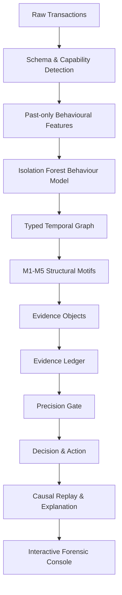

# TRACE-FX
**Real-Time Financial Fraud Intelligence Engine**

TRACE-FX is an offline, CPU-only, locally-executable fraud detection system designed for the HNX26PSI04 Hackathon.

> **Don't just detect the fraud. Show the evidence, and show why we didn't accuse the innocent.**

## Key Features
- **Deterministic Engine**: The same data and config always yield the exact same decisions.
- **Evidence Ledger**: Every decision (FRAUD / REVIEW / LEGIT) is backed by an explicit point-based ledger. No black-box scores.
- **Structural Fraud Motifs**: Graph-based structural anomaly detection out-of-the-box (Shared Device, Common Sink, Pass-Through, Sequence Cohorts, Burst).
- **Causal Alerting**: Ensures no future information leaks into past alerts (`alert_ts`).
- **Fail-Soft Architecture**: Components gracefully degrade upon failure instead of crashing the pipeline.

## Quickstart

```bash
# Setup the environment
make setup

# Generate synthetic datasets for evaluation
make data

# Run the test suite
make test

# Evaluate the pipeline
make eval

# Launch the interactive Streamlit demo
make demo
```

## Structure
- `src/tracefx/` - Core detection engine, totally pure, headless.
- `app/` - Streamlit interactive demo dashboard.
- `tests/` - Comprehensive test suite.
- `docs/` - Architecture specs and rationales.
- `data/` - Synthetic data (generated via `make data`).
- `reports/` - Generated evaluation reports and replays.

---

# TRACE-FX — Technical Architecture & Engineering Specification

## Problem Statement
HNX26PSI04 - Real-Time Financial Fraud Intelligence

## Executive Summary
TRACE-FX explicitly separates *unusual behaviour* from *coordinated fraud*. Every fraud decision is backed by an auditable evidence ledger constructed from structural anomaly motifs (shared devices, common sinks, sequence cohorts) and is protected by a deterministic precision gate that strictly prohibits accusing legitimate high-value users based on behaviour alone.

## System Architecture / End-to-End Data Flow


## Repository Structure
- `src/tracefx/` - Core detection engine (pure, deterministic, zero UI dependency)
- `app/` - Streamlit interactive forensic console
- `tests/` - Comprehensive pytest suite
- `data/` - Synthetic data and ground-truth artifacts
- `reports/` - Evaluation metrics
- `scripts/` - Utilities and vendor helpers
- `docs/` - Architectural documentation and walkthroughs

## Tech Stack
- **Python >= 3.10**
- **pandas, numpy, scikit-learn, networkx** (Data & ML engine)
- **streamlit, vis-network** (UI & Visualization)
- **pytest** (Testing)
- **pyyaml, jinja2** (Config & templating)

## Data Contract
Required fields: `tx_id, ts, payer_id, payee_id, amount`
Optional fields: `tx_type, device_id, ip, merchant_id, item_id, channel, city, account_open_date`

## Capability Detection
The engine dynamically detects available optional fields to enable/disable structural motifs, gracefully degrading without throwing errors if fields are missing.

## Feature Engineering
TRACE-FX builds temporally causal features:
- `velocity_1h`, `velocity_24h`
- `amount_vs_p95`, `amount_pct_rank`
- `new_device_flag`, `new_payee_flag`

## Behavioural ML Model (Isolation Forest)
Features are fed into an Isolation Forest (`n_estimators=100`, `contamination=0.02`) to identify multivariate outliers. 
- `X_t = [actual features available at or before t]`
- `X_t → IF → anomaly score`
The output is scaled to `[0, 1]` representing a behavioural anomaly score. **This score is evidence only and cannot independently cross the precision gate to produce a FRAUD label.**

## Temporal Leakage Controls
- Features use past-only rolling aggregations.
- `alert_ts` records the precise moment sufficient evidence was reached.

## Typed Temporal Graph
A typed, timestamped multigraph (`networkx.MultiGraph`) connecting accounts, devices, IPs, and merchants. 

## Hub Caps
TRACE-FX actively suppresses high-degree shared infrastructure (e.g. `deg_cap_device = 8`) to avoid falsely merging unconnected users.

## M1 Shared Device/IP
2+ accounts sharing a device without prior legitimate history.

## M2 Common Sink
4+ distinct payers converging on one payee within 24h.

## M3 Pass-Through
80%+ of received funds transferred onward within 30 minutes.

## M4 Sequence Cohort
4+ accounts sharing 2+ rare merchant/item 3-grams.

## M5 Burst
High-velocity localized transactions exceeding 3σ.

## Evidence Model & Evidence Ledger
Signals are accumulated as points in an auditable ledger:
`NetEvidence = Σ positive evidence - Σ exculpatory evidence`
Points: `shared_device: +20`, `common_sink: +30`, `pass_through: +25`, `sequence_cohort: +25`, `burst: +10`.

## Exculpatory Evidence
Negative evidence subtracts points to suppress false positives: `tenure_over_1y: -15`, `repeat_payee_3plus: -20`, `amount_within_p95: -10`.

## Precision Gate
FRAUD requires BOTH:
1. `net_points >= 60`
2. `>= 2` independent structural evidence types

REVIEW triggers at `net_points >= 30` or any single strong structural signal. LEGIT otherwise.

## Transaction Risk
Risk `p_i = clip(net_points/100, 0, 1)`.

## Account Risk
Account Risk is rolled up using Noisy-OR over transaction risks:
`R_account = 1 - Π(1 - p_i)`

## Fraud Group/Ring Construction
Groups are constructed from connected components over **EVIDENCE LINKS**, not raw graph connectivity, effectively clustering coordinated fraud while ignoring shared benign infrastructure.

## Causal Alert Timestamp
The `alert_ts` is the exact `Evidence.satisfied_at` timestamp where the precision gate conditions were strictly met, ensuring no future information leakage.

## Action Policy
- **FRAUD**: Hold + Escalate
- **REVIEW**: Step-up authentication + Analyst review
- **LEGIT**: No action

## Evaluation
Detection and evaluation are completely decoupled. The detection pipeline does not access labels. The evaluator consumes separate `truth_<seed>.json` artifacts to compute Recall, Precision, PR-AUC, and Ring Detection metrics.
- **seedA (2k acc)**: 100% Ring Recall (5/5 rings detected)
- **seedB (2k acc)**: 100% Ring Recall (5/5 rings detected)
- **seedC (2k acc)**: 100% Ring Recall (6/6 rings detected)

## Hybrid Dataset
External background data injected with simulated structural motifs to test robust capability detection and structural scaling.

## Streamlit Investigation Console
A highly optimized Streamlit forensic console with 7 standalone pages (Mission Control, Detection Quality, Investigate, Fraud Networks, Temporal Replay). The `Result` object persists in `st.session_state` preventing expensive pipeline re-execution during navigation.

## Pipeline Runtime / Performance
~23.5 seconds for a 45,000+ row execution on local CPU (achieved via vectorized `cumsum`/`cumcount` feature engineering, O(log N) `bisect` sliding windows for M2 motifs, and fully parallelized exculpatory ledger construction).

## Testing
Comprehensive pytest suite covering all components. `python -m pytest -q` passes 56/56 tests.

## Determinism
Fully reproducible using fixed `seed` configurations in `config.yaml`.

## Security
Strict `.gitignore` enforcement. No API keys or credentials exposed. No raw datasets committed accidentally.

## Disclosure
- Streamlit, Scikit-Learn, NetworkX for core mechanics.
- Vis-Network vendored for interactive graph UI.

## PS04 Coverage
- **Learn normal behaviour**: Handled by Isolation Forest.
- **Spot anomalies**: Features vs IF baseline.
- **Coordinated rings**: Typed graph + M1-M5 motifs + evidence group linking.
- **Risk scores**: Ledger-backed Noisy-OR.
- **False-positive control**: Exculpatory ledger constraints + Hub Cap mechanism.

## Reproducibility
`make setup && make data && make test && make eval && make demo`

## Known Limitations
- Purely offline, not optimized for real-time streaming topologies.
- Graph analysis is bound by available system memory for extreme multi-million node datasets.
